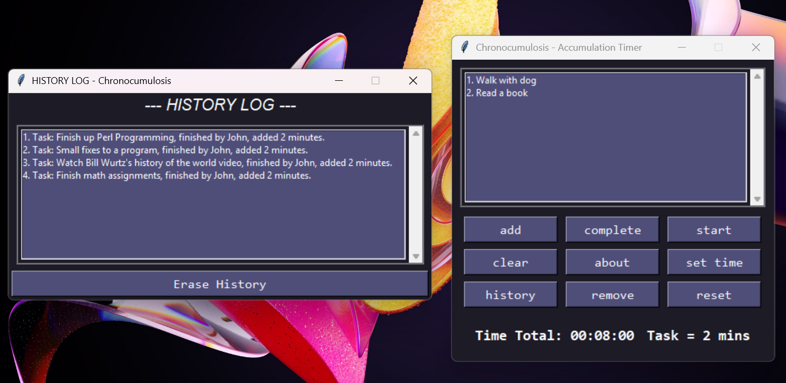

# Chronocumulosis - Accumulation Timer
**Version 1.0 - The Initial Loadout**

> Productivity, with a hint of reward.

Ever find yourself wanting to be productive, but also needing those well-deserved breaks? This timer offers a unique solution: complete tasks from your to-do list and earn break time as a reward. Once you've checked off your tasks, start the timer and enjoy the break you've rightfully earned, free from the nagging feeling of procrastination.

This application is for anyone who wants to build a healthy and rewarding relationship with their to-do list.




## Features

*   **Accumulation Timer**: Earn break time by completing tasks.
*   **Task Management**: Easily add, complete, remove, or clear all tasks.
*   **Customizable Rewards**: Set how many minutes you earn per completed task.
*   **History Log**: View a temporary log of your completed tasks.
*   **Audio Notification**: A pleasant jingle plays when your break time is over.
*   **Motivational Messages**: Receive a random praise message upon task completion.

## Getting Started

Follow these instructions to get a copy of the project up and running on your local machine.

### Prerequisites

This project requires Python 3 and the following libraries:
*   PyGame
*   NumPy

You can install them using pip and the provided `requirements.txt` file.

```sh
pip install -r requirements.txt
```

### Running the Application

1.  Clone the repository to your local machine:
    ```sh
    git clone https://github.com/your-username/python-gui_accumulation_timer.git
    ```
2.  Navigate to the project directory:
    ```sh
    cd python-gui_accumulation_timer
    ```
3.  Run the application:
    ```sh
    python main.py
    ```

## Acknowledgements
*   This project was created by **KDTal1**.
